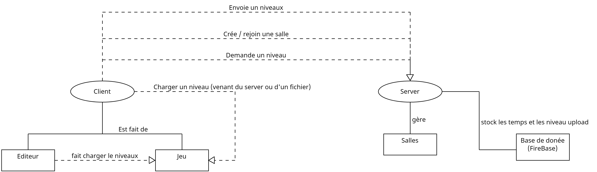

# Cahier des charges — Projet libre

## 1. Informations générales

- **Nom du projet** : Build and Jump
- **Membres de l'équipe** : Theo Bensaci, Maxime Regenass, Santiago Sugrañes
- **Lien du dépôt Git** : https://github.com/Me-Theo/Build_And_Jump

---

## 2. Description du projet

Build and Jump est un jeu de plateforme web dans lequel les joueurs peuvent créer leurs propres niveaux grâce à un éditeur intégré, puis les partager et les essayer en multijoueur.

Le jeu permet également d’faffronter d’autres joueurs en temps réel. Les déplacements des autres participants sont visibles sous forme de "fantômes", pour voir comment les joueurs negocient la carte.

Le concept s’inspire notamment de jeux comme Mario Maker.

Si le temps le permet, nous aimerions intégrer un véritable mode course sur des niveaux créés par les joueurs. Sinon, un mode "time attack" constituera déjà une première version satisfaisante, où les joueurs essaient d'obtenir le meilleur temps de la salle.

---

## 3. Objectifs

L’utilisateur doit pouvoir :

- créer un niveau
- sauvegarder un niveau localement
- publier un niveau afin que d’autres joueurs puissent y jouer
- jouer à des niveaux créés par d’autres utilisateurs
- créer une salle multijoueur
- rejoindre une salle existante
- voir les autres joueurs se déplacer en temps réel
- consulter les meilleurs temps des joueurs présents dans la salle
- consulter le classement global des meilleurs temps d’un niveau

---

## 4. Fonctionnalités

### 4.1 Fonctionnalités principales

#### Jeu

- Jouer à un niveau en local
- Recommencer rapidement un niveau
- Disposer d’une variété d’objets de gameplay :
  - blocs
  - piques
  - plateformes mobiles
  - checkpoints
  - etc.
- Intégrer plusieurs mécaniques de déplacement inspirées de Celeste :
  - Coyote Time
  - Input Buffering
  - Halved-Gravity Jump Peak
  - Jump Corner Correction
  - Semi-Solid Popping (si compatible avec notre système de mouvement)
  - Lift Momentum Storage

Référence : https://maddythorson.medium.com/celeste-forgiveness-31e4a40399f1

#### Éditeur de niveaux

- Charger un niveau depuis un fichier local
- Tester directement le niveau créé
- Sauvegarder un niveau localement au format JSON
- Sélectionner différents outils d’édition
- Pouvoir placer tous les objets disponibles dans le jeu afin de créer un niveau complet sans devoir modifier de code

#### Fonctionnalités en ligne

##### Gestion des niveaux

- Publier un niveau sur le serveur avec un nom
- Télécharger des niveaux créés par d’autres utilisateurs

##### Système de salles

- Créer une salle "time attack"
- Associer un niveau à une salle
- Rejoindre une salle via un identifiant (code généré automatiquement)
- Voir les autres joueurs se déplacer en temps réel
- Afficher les meilleurs temps des joueurs présents dans la salle

##### Classements

- Enregistrer les temps réalisés par les joueurs sur le serveur
- Associer chaque score à un niveau et à un pseudonyme
- Afficher le top 5 des meilleurs temps pour chaque niveau

---

## 4.2 Fonctionnalités optionnelles

- Ajouter davantage d’objets de gameplay
- Ajouter différents modes de jeu en ligne
  - knockout
  - race
- Ajouter un système de comptes utilisateurs
- Ajouter un mode "Jam"
  - plusieurs joueurs disposent d’un temps limité pour créer un niveau
  - tous les joueurs doivent ensuite jouer sur chacun des niveaux créés
  - le gagnant est celui ayant obtenu le meilleur classement moyen

---

## 5. Technologies

- **Moteur de jeu** : moteur maison développé durant la durée du projet par nos soins en JavaScript vanilla :]
  - **Frontend** : rendu graphique via l’API Canvas (géré par le moteur de jeu)
- **Communication réseau** : WebSocket
- **Base de données** : Firebase / Firestore
- **Back-end** : Express

---

## 6. Architecture

L’application sera composée :

- d’un client web contenant le moteur de jeu et l’éditeur de niveaux
- d’un serveur Express gérant les communications en ligne
- d’une base de données Firebase / Firestore pour stocker
  - les niveaux
  - les scores
  - les informations des salles

Les communications en temps réel entre les joueurs seront via WebSocket

---

## 7. Évolutions possibles

- Ajout de nouveaux objets et mécaniques de gameplay
- Création de modes de jeu compétitifs supplémentaires
- Ajout d’un système de comptes et de profils utilisateurs
